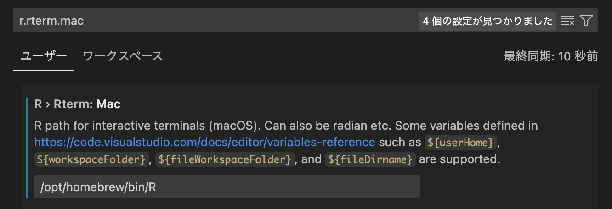
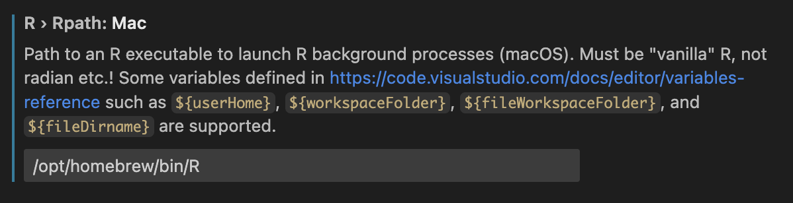
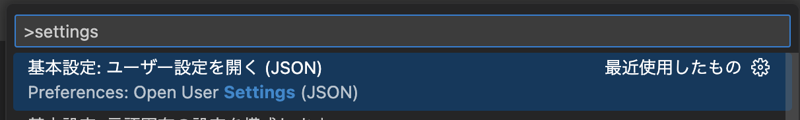
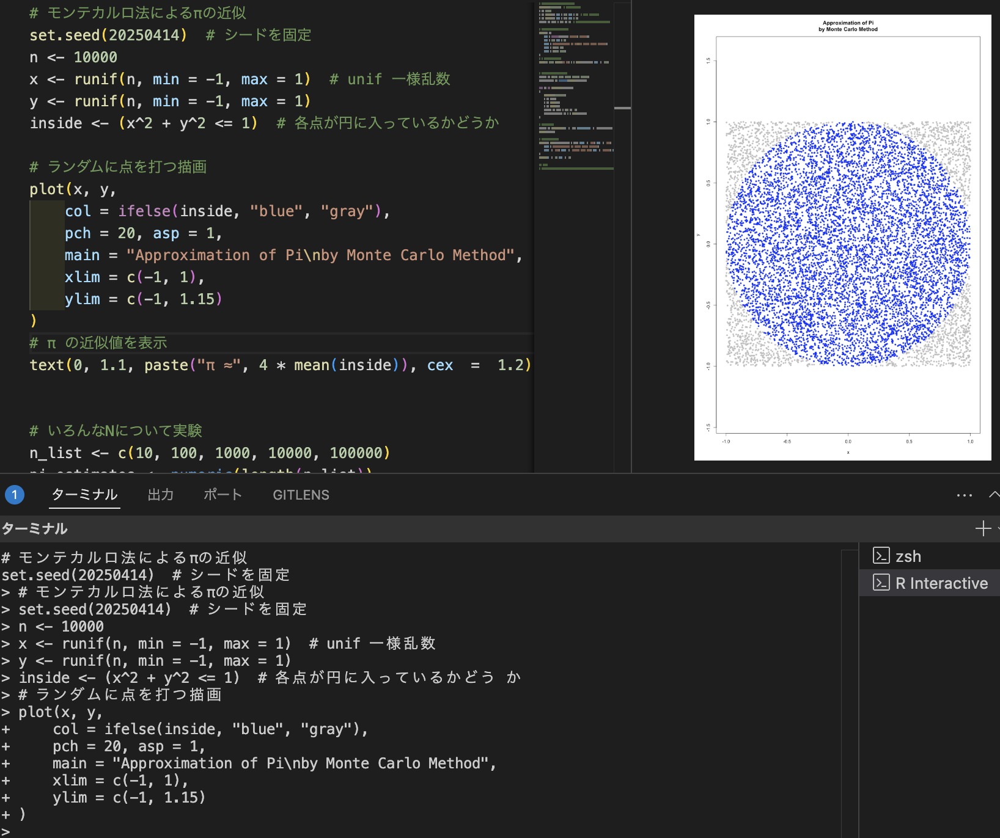

こんにちは、溝渕です。

今日は、MacにR言語の開発環境を整えてみたので、その手順を記録しておこうと思います。

## 作業環境
| **項目** | **内容** |
| --- | --- |
| OS | macOS 14.4.1 (23E224) |
| チップ | Apple M1 |
| ターミナル | zsh（mac標準） |
| エディタ | VSCode |

## Rのインストール
まずは定番のHomebrewを使ってRをインストールしました。
https://formulae.brew.sh/formula/r
```bash
brew install --cask r
```
インストール後、実行ファイルの位置とバージョンを確認しておきます。
```bash
which R
# → /opt/homebrew/bin/R

R --version
# → R version R version 4.4.3 ...
```
また、RのLanguage serverもインストールします。
```
R
> install.packages("languageserver")
```


## VSCode拡張機能のインストール
以下の拡張機能をインストールしました。

https://marketplace.visualstudio.com/items/?itemName=REditorSupport.r


### 拡張機能の設定
`cmd+,`で設定を開き、`r.rterm.mac`と検索し、テキストボックスに実行ファイルのpath（`/opt/homebrew/bin/R`）を入力しました。

`r.rpath.mac`にも同様の設定を行いました。


### 2025-04-21 追記：保存時に自動フォーマットする
`cmd + shift + P`からsettings.jsonを開き、以下を設定しました。
```
"[r]": {
        // インデント幅を2にする
        "editor.tabSize": 2,
        // R ファイルを保存したときに整形を走らせる
        "editor.formatOnSave": true,
        // R 拡張をデフォルトのフォーマッタに指定
        "editor.defaultFormatter": "REditorSupport.r"
    },
```



## いろいろ試してみる
`cmd+Enter`を入力すると、現在カーソルを当てている行が実行されていく仕組みらしいです。
一括で実行したい場合は、`Rscript your_script.R`


## おまけ
以下に今回作成したRのスクリプトを掲載しておきます。

```R
# モンテカルロ法によるπの近似
set.seed(20250414)  # シードを固定
n <- 10000
x <- runif(n, min = -1, max = 1)  # unif 一様乱数
y <- runif(n, min = -1, max = 1)
inside <- (x^2 + y^2 <= 1)  # 各点が円に入っているかどうか

# ランダムに点を打つ描画
plot(x, y,
    col = ifelse(inside, "blue", "gray"),
    pch = 20, asp = 1,
    main = "Approximation of pi\nby Monte Carlo Method",
    xlim = c(-1, 1),
    ylim = c(-1, 1.15)
)
# π の近似値を表示
text(0, 1.1, paste("pi ≈", 4 * mean(inside)), cex  =  1.2)
```