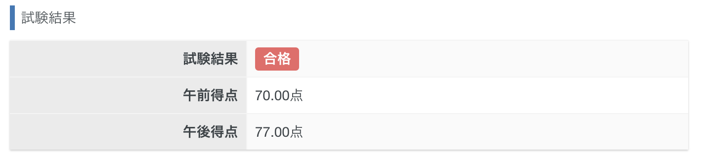
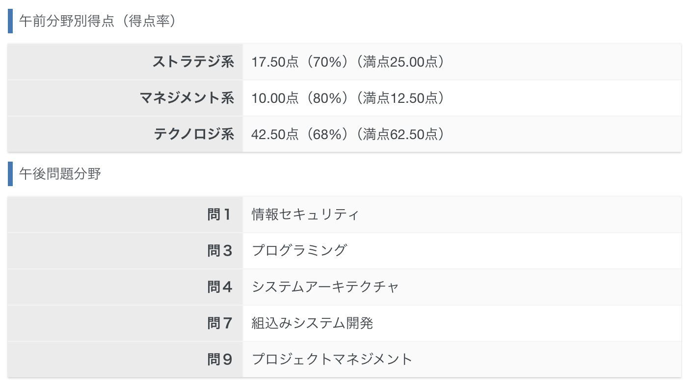

こんにちは、溝渕です。
2024/04/21に応用情報技術者試験を受験し、合格できたので、その過程を本ページに記します。

## 受験動機
3月は少し時間に余裕があり、大学院入学前に情報分野の知識を網羅的に復習しておきたいなと思ったのがきっかけです。  
せっかく勉強するなら何か形に残しておこうと思い、資格取得を目指すことにしました。  
応用情報なら就職活動でも少しは話のタネになるかな〜という気持ちもありました。

## 試験概要
応用情報技術者試験（AP）は、情報処理技術者試験の1つで、基本情報の次に位置づけられる国家試験です。  
システム開発、マネジメント、セキュリティ、ネットワークなど、広範な分野に関する知識と応用力が問われます。

試験は午前と午後に分かれており、それぞれ以下の通りです。

- **午前試験**：選択式の知識問題（4択）
- **午後試験**：記述式の応用問題（記述、11問中5問選択）

## 試験準備
### 使用した教材
- [応用情報技術者試験ドットコム](https://www.ap-siken.com/)（寄与：☆☆☆☆☆）  
  - 無料で過去問演習ができて非常に便利。これだけでかなり対応できます。
  
- [『キタミ式イラストIT塾 応用情報技術者 令和05年』](https://gihyo.jp/book/2022/978-4-297-13188-3)（寄与：☆☆☆☆☆）  
  - 丁寧でわかりやすい説明。通読しながら理解を深めました。2周ほど読みました。

- [『令和06-07年 応用情報技術者 試験によくでる問題集【午後】』](https://gihyo.jp/book/2024/978-4-297-13965-0)（寄与：☆）  
  - 午後対策に購入。ただ、応用情報技術者試験ドットコムで十分だと思います。

### 午後問題の選定
前述の通り、午後試験は11問中5問を選択する必要があります。
自分は必須のセキュリティ＋高専での授業を通じて理解が深かった以下の4分野を選択しました。
- 問1 セキュリティ
- 問3 プログラミング
- 問4 システムアーキテクチャ
- 問7 組み込みシステム
- 問9 プロジェクトマネジメント

### 学習記録
午前試験は、キタミ式を1周した後、応用情報技術者試験ドットコムで午前試験の過去問を解き、自身の得意・不得意を把握しました。
その後、不得意だったデータベースやストラテジを重点的に復習しました。

午後試験は、過去問を4、5回程度解いて対策しました。
学習時間はざっくり30時間ほどでしょうか。

## 試験当日の流れ
会場が自宅から徒歩圏内だったので、当日はゆったり目に出発。  
試験開始前に周辺を少し散歩しつつ、リラックスして向かいました。

### 持ち物
- 受験票（郵送）
- 身分証
- シャーペン
- 消しゴム

## 結果
午前試験：70点、午後試験：77点で、無事合格することができました！

午前はテクノロジ系の調子が良くなかったのですが、全体としては合格ラインをしっかり超えられてよかったです。

午後試験は、得意だったプログラミングと組み込みでしっかり得点できたのが勝因だったと思います。自己採点をもとに、得点率をざっくり予想してみました。

| 問題番号 | 分野                   | 得点（予想） |
|----------|------------------------|----------------|
| 問1      | セキュリティ           | 17          |
| 問3      | プログラミング         | 20         |
| 問4      | システムアーキテクチャ | 15          |
| 問7      | 組み込みシステム       | 20         |
| 問9      | プロジェクトマネジメント | 5        |

## かかった費用
全部で14430円でした。内訳は以下の通りです。
- 受験料：7500円
- キタミ式：3630円
- 過去問集：3300円

本はメルカリで売却して、4000円程戻ってきました。

> Photo by [Pawel Czerwinski](https://unsplash.com/@pawel_czerwinski) on [Unsplash](https://unsplash.com/)