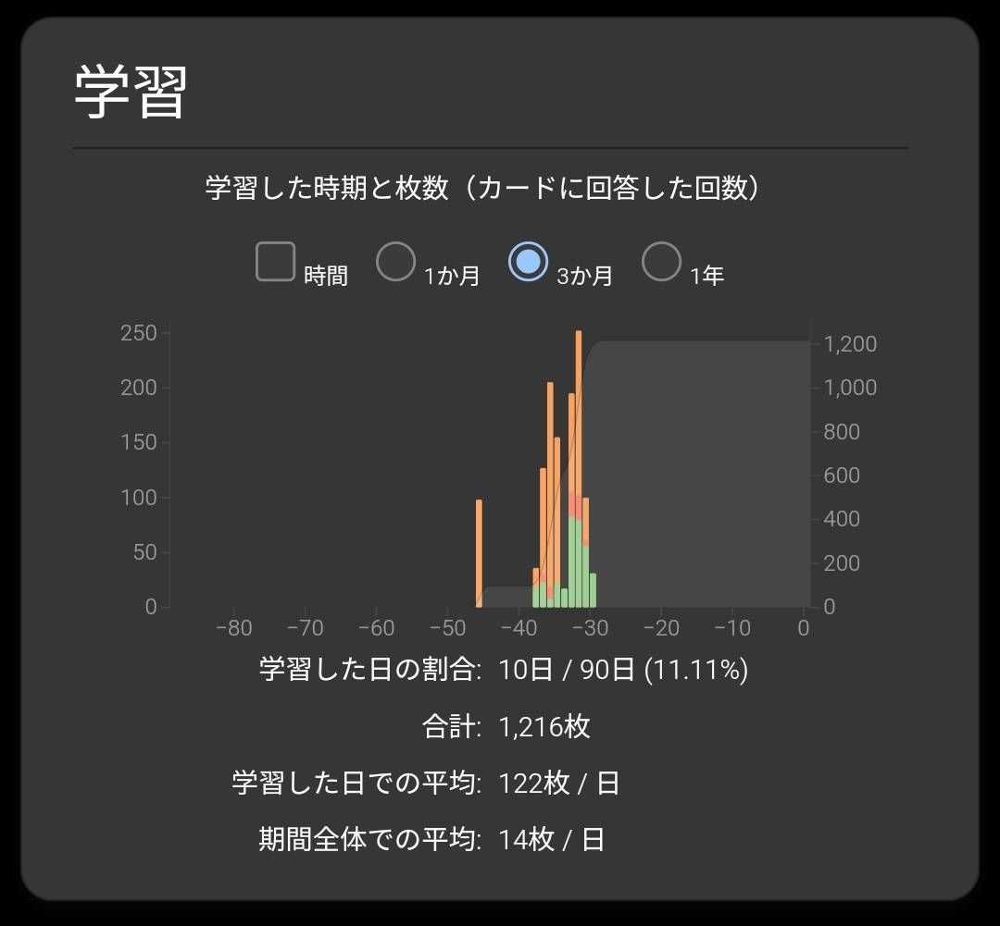

こんにちは、溝渕です。
2025/03/22にHSK3級を受験したので、その過程を本ページに記します。

## 受験動機
きっかけは、友人が楽しそうにやっていたDuolingoの中国語コース。興味本位で自分も始めてみたところ、ゲーム感覚でどんどん進められて、思いのほかハマってしまいました。語学学習は目標があるとモチベーションが維持しやすいことを知っていたので、資格でも取ってみようかな？と思いました。

どうせ受けるなら、ある程度実用的なレベルに挑戦したい。CEFR（ヨーロッパ言語共通参照枠）でB1に相当するものがいいなと調べた結果、HSK3級にたどり着き、受験を決めました。

## 試験概要
HSK3級は、中国語能力を測る資格試験で、目安として大学2年前期の第二外国語レベル、600語程度の語彙力が求められます。

試験は「聴解」「読解」「作文」の3セクションで構成されていて、日常会話の理解や、簡単な文章の読み書きができるかどうかをチェックされます。

HSK 日本公式サイトの説明によると、以下の通り。
> 「中国語を使って、生活、学習、仕事等における基本的なコミュニケーションができる。中国旅行の時も大多数の場合において中国語で対応することができる」ことが求められます。

引用：[https://www.hskj.jp/level/w_3/](https://www.hskj.jp/level/w_3/)

## 試験準備

### 使用した教材
- [Anki](https://apps.ankiweb.net)（寄与：☆☆☆☆）
  - 語彙の習得のため使いました
- [SuperTest（旧HSK Online）](https://www.hskonline.com/ja/)（寄与：☆☆☆☆☆）
  - 文法の習得及び問題演習のために使いました

### 学習記録
Ankiでは1216枚のカードを勉強しました。
HSK3級は300単語程度なので、4周ちょいくらいです。

SuperTestでは11時間23分17秒勉強しました。
主に"コンボ"と呼ばれる対策講座を受講していました。全5章のうち、3章の途中までクリアしました。
また、試験前日（当日？）の深夜に模擬テストを2回を行いました。

トータルで20時間程でしょうか。

## 試験当日
### 持ち物
- 受験票（スマホ）
- 筆記用具
  - シャーペン
  - 消しゴム
- 腕時計
- スリッパ（受験会場によっては必要）

### 流れ
- **13:00 受付**
  - 少し早めに試験会場に到着。受付では身分証明書と受験票を見せて入室しました。
- **13:05 入室**
  - 先にに入室していた友人に軽く会釈しつつ着席、席はリスニングが聞き取りやすい最前列で大当たり。受験票を参考にしながら、解答用紙に氏名や受験番号などを記入しました。試験開始までは少し余裕があったので、SuperTestでリスニング対策をしました。
- **13:30 試験説明**
  - 試験監督から禁止事項や途中退出に関する説明を受けました。サッカーのように、イエローカード＆レッドカードの制度がありました。
- **13:45 聴解**
  - 難易度は普通〜ちょい難。さすがに6割は取れてるはずです。
- **14:25 読解**
  - 普通に解けました。OK
- **14:55 作文**
  - 拼音に対応する漢字を書くセクションが難しかったです。
- **15:10 試験終了**
  - ご褒美にライフで40%オフの酒蒸し饅頭を買い、帰宅しました。

## 結果
受験日の約1ヶ月後（4月末？）に発表されるそうです。

## かかった費用
合計で9547円。内訳は以下の通り
- 受験料：6600円
- SuperTest Plus (1 month)：1880円
- 交通費：920円
- 饅頭：147円

## おわりに
Duolingoで始めたゆる〜い語学学習

今後も、Duolingoで中国語の勉強をもう少し続けて、余裕があればHSK4級にも挑戦してみたいなーと思っています。とはいえ、あくまで趣味なので、のんびりマイペースに。

> Photo by [Pawel Czerwinski](https://unsplash.com/@pawel_czerwinski) on [Unsplash](https://unsplash.com/)