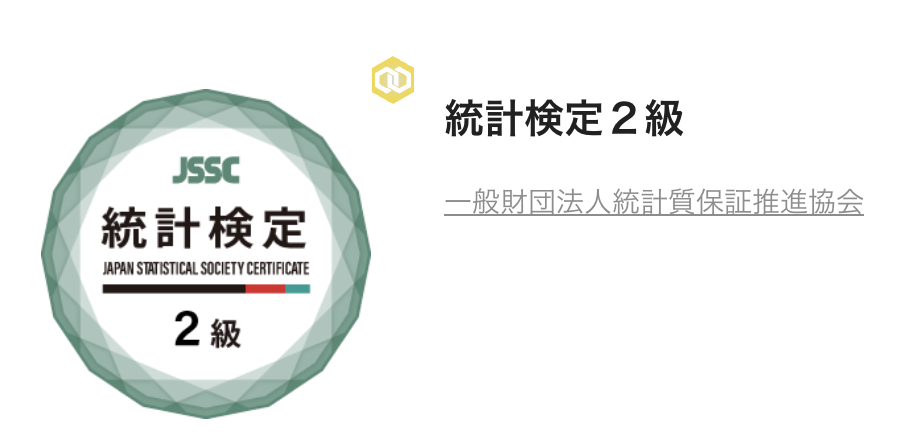

こんにちは、misonikomipanです。
2023/08/20に統計検定2級を受験し合格できたので、その過程を本ページに記します。

## 受験動機
大学院入試のために統計学を勉強していたのですが、せっかくなので何か形に残そうと思い、統計検定2級を受験しました。

## 試験概要
統計検定2級は、**大学基礎課程（1・2年次学部共通）で習得すべき統計学の知識や活用力**を検定する試験です。

出題範囲は記述統計から推測統計、回帰分析、検定、分散分析など基礎的な統計手法全般がカバーされています。

詳細は公式サイト： https://www.toukei-kentei.jp/

## 試験準備
### 使用した教材
- 📘[統計検定 2級公式問題集[CBT対応版]](https://www.google.co.jp/books/edition/日本統計学会公式認定統計検定_2級公式問題集_CBT対応版_/KZF4zwEACAAJ?hl=ja&sa=X&ved=2ahUKEwjMyY-01ZOLAxWqklYBHXnCMdAQiqUDegQIDBAC)
  - 試験形式や内容を把握するために使用。CBT形式に対応しているものを買おう。
- 📗[統計学演習 培風館](https://www.google.co.jp/books/edition/統計学演習/J-nXAAAACAAJ?hl=ja)
  - 院試対策時に使用
- 📙[マセマ・確率統計](https://www.google.co.jp/books/edition/スバラシク実力がつくと評判/ZxsgNwAACAAJ?hl=ja)
  - 院試対策時に使用
- 📝大学院の過去問
  - 院試対策時に使用

### 学習記録
学習時間の記録はしていませんが、  
- 公式問題集：試験前日にざっくり1周
- 統計学演習 & マセマ：院試対策中に使用  

すべて合わせると 40-50時間程度だと思います。

## 試験当日の流れ
会場が自宅から近かったため、自転車で向かいました。
試験会場には少し早めに到着し、受付で身分証明書を提示して受験票と照合してもらいました。
席に案内された後に計算用紙、筆記用具、確率分布表、そしてヘッドホンを渡されました。

### 持ち物
- 電卓（関数電卓は不可）
- 受験票

## 結果
得点率77%で合格でした。解いた感触としては85%くらいあると思っていたので少し悔しかったです。ちゃんと見直しをしよう。

### 2023-12-20 追記

なんかバッジがもらえました。

## かかった費用
7500円。内訳は以下の通り
- 受験料：5000円（学割価格）
- 公式過去問集：1500円（メルカリ）
- 電卓：1000円

> Photo by [Pawel Czerwinski](https://unsplash.com/@pawel_czerwinski) on [Unsplash](https://unsplash.com/)